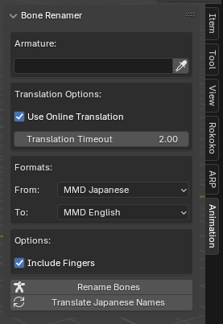

# MMD Bone Renamer



A Blender addon that translates Japanese MMD (MikuMikuDance) bone names to English using both Google Translate and a static dictionary.

> ⚠️ **IMPORTANT:** Currently, only the MMD Japanese to MMD English conversion has been thoroughly tested and verified. Other format conversions are experimental and may not work as expected.

## Features
- Reliable conversion from Japanese MMD bone names to English MMD format using:
  - Online Google Translate (optional)
  - Built-in static dictionary
  - Intelligent L/R suffix handling
  - Configurable translation timeout
- Experimental support for other formats (untested):
  - XNALara
  - DAZ/Poser
  - Blender Rigify
  - Sims 2
  - Motion Builder
  - 3ds Max
  - Type X
  - BEPu
- Additional Features:
  - Optional finger bone renaming
  - Pick armature directly from viewport
  - Bone name display toggle
  - Clean name formatting for Blender compatibility

## Running the Script
1. Download `BoneRenamer_v1.2.py`
2. In Blender, switch to the "Scripting" workspace tab
3. Click "Open Text" and select the downloaded script
4. Click "Run Script" or press Alt + P
5. The addon panel will appear in the Animation tab of the 3D Viewport's sidebar

### Optional: Google Translate Support
To enable online translation:
```bash
pip install googletrans==3.1.0a0
```

## Usage
1. Open the Animation tab in the 3D Viewport's sidebar (press N if hidden)
2. Find the "Bone Renamer" panel
3. Select your armature using the picker or dropdown
4. For best results, use:
   - Source Format: "MMD Japanese"
   - Target Format: "MMD English"
5. Configure options:
   - Include fingers
   - Use online translation (if available)
   - Set translation timeout
6. Click "Rename Bones" or "Translate Japanese Names"

## Options
- **Source/Target Format**: Choose between different naming conventions (Japanese to English MMD recommended)
- **Include Fingers**: Toggle finger bone renaming
- **Use Online Translation**: Enable Google Translate for unknown Japanese terms
- **Translation Timeout**: Maximum wait time for online translation

## Supported Bone Types
- Basic body bones (head, neck, spine, etc.)
- Arm and leg bones
- Finger bones
- Common MMD auxiliary bones
- IK bones

## Requirements
- Blender 2.80 or newer (Working on Blender 4.3)
- Python 3.7+
- Internet connection (for online translation feature)

## Known Limitations
- Only Japanese MMD to English MMD conversion has been thoroughly tested
- Other format conversions are experimental and may not work correctly
- Online translation requires additional package installation
- Some very specific or custom bone names may not be recognized
- Complex bone hierarchies might need manual adjustment after renaming

## Contributing
Feel free to submit issues, fork the repository, and create pull requests for any improvements. Help with testing and verifying other format conversions would be particularly welcome.

## License
This project is licensed under MIT License - see the LICENSE file for details.
